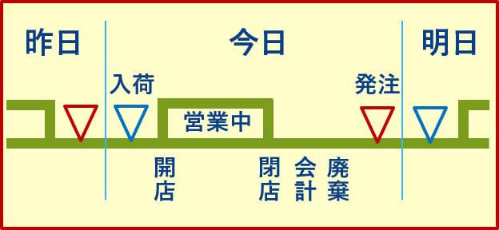

# AiBiCmart Simulator: PBL用小売店舗シミュレータ

AiBiC関西が2017年度～2020年度にかけて実施した教育コース「[AiBiC Spiral](https://aibic-spiral.enpit.jp/)」で使用したPBL用小売店舗のシミュレータです。
ビッグデータ処理、人工知能、クラウド技術を融合した現実的な課題として、「スーパーマーケットにおける購買履歴に基づく売上予測と自動発注問題」を
題材としたPBLを実施するための、サーバ側のプログラムです。

シミュレータはREST APIを提供するサーバとして実装されています。API経由でシミュレータ起動、売上予測に必要なデータの取得、発注指示、シミュレート結果の確認などを行います。
本シミュレータは Jersey RESTful Web Services 2.x framework を用いて開発されています。動作にはJREとTomcatが必要です。

## PBL課題の概要

ビッグデータ処理、人工知能、クラウド技術を融合した現実的な課題の一つとして、スーパーマーケットにおける自動発注問題を題材とした PBL を実施しました。
受講生はクラウド上にデプロイされた店舗シミュレータアプリに、REST API を利用してアクセス・操作します。

大まかな流れは以下の通りです。

* 人工知能を用いたスーパーの自動発注システムの開発
  * 明日の商品の売れ行きを予測する
  * 予測結果をもとに、実際に商品をいくつ発注するかを決める
* 開発したシステムを用いた自動発注コンテスト
  * 売上、利益、ロス（機会損失と廃棄）など

AiBiC関西では、Python言語のラッパーライブラリを用意して、REST API へのアクセスを容易にしました。PBLの難易度設定や環境に応じて、直接 REST API を操作するのかライブラリを別途用意するのかを決めてください。

## 店舗シミュレータ

ユーザから見た店舗シミュレータの利用手順は以下の通りです。

* 店舗インスタンス生成
* シミュレート期間の間以下を繰り返す
  * 予測に必要なデータの取得
  * 発注指示
* 最終的な結果の取得

### 店舗シミュレータの仕様

* ユーザの指示により店舗インスタンスを生成する
* 同一ユーザが同時に利用できる店舗インスタンスは1つとする
* 教員が設定した範囲内でシミュレート期間を指定することができる
* 1つの店舗インスタンスにつき指定した1つの商品を取り扱う
* 仕入れ価格は商品ごとに一定とする
* 発注の単位は1個（販売単位と同じ。箱やロットはない）とする
* 発注の翌日開店時までに商品は入荷されるものとする
* 消費期限は商品ごとに一定とする
* 商品は新しいものから売れるものとする
* 消費期限が近い商品の割引販売などは行わない

### 1発注ごとの業務サイクル

ユーザから発注指示を受け取ると以下の業務サイクルが進みます。

* 日付が1日進む
* 発注した商品が入荷する
* その日の売り上げにもとづき会計処理、廃棄処理が行われる
  * 入荷が新しい商品から売上個数分の在庫を減らす
    * 機会損失の計算
  * 1日の損益=売上金額−仕入金額を計算
  * 消費期限の過ぎた在庫の破棄
    * 廃棄ロスの計算

## デプロイ手順

本シミュレータの動作にはJREとTomcatが必要です。
また、シミュレーション用のデータ（POSデータ、気象データ、ユーザ情報）を用意して配備する必要があります。

詳細なデプロイ手順書は [doc/Deploy.md](./doc/Deploy.md) をご覧ください。リソースの仕様も記載されています。

## サンプルリソース

動作確認用のサンプルリソースは`doc/martresource_sample`以下に用意してあります。説明と動作例は[doc/martresource_sample/Sample.md](./doc/martresource_sample/Sample.md)を参照してください。

## API仕様

API仕様は [doc/api.html](./doc/api.html)を参照してください。

## 発表論文

本システムは文部科学省「成長分野を支える情報技術人材の育成拠点の形成（[enPiT](https://www.enpit.jp/)）」 ビッグデータ・AI分野　「ビッグデータ・AI・クラウド技術を用いた課題解決人材育成」([enPiT AiBiC](https://aibic.enpit.jp/)) の教育プロジェクトの一環として開発されました。

本システムを用いたPBLの概要およびその授業改善については、以下の発表論文をご参照ください。

* 佐伯 幸郎, 福安 直樹, 神田 哲也, 市川 昊平, 吉田 真一, 中村 匡秀, 楠本 真二: "自己評価と客観評価の変化に基づく実践的人材育成コースにおける質的教育効果の測定", コンピュータソフトウェア, Vol.38, No.1 (2021), pp.52-64, 2021年1月
* 佐伯 幸郎, 福安 直樹, 神田 哲也, 市川 昊平, 吉田 真一, 中村 匡秀, 楠本 真二: "自動発注問題を題材とした実践的人材育成コースにおける授業改善", コンピュータソフトウェア, Vol.37, No.1 (2020), pp.19-30, 2020年1月
* 神田 哲也, 福安 直樹, 市川 昊平, 佐伯 幸郎, 楠本 真二: "自己評価と客観評価の変化に基づく実践的人材育成コースにおける教育効果測定の報告", 第6回実践的IT教育シンポジウム(rePiT2020), 2020年1月
* 佐伯 幸郎, 福安 直樹, 神田 哲也, 市川 昊平, 吉田 真一, 中村 匡秀, 楠本 真二: "自動発注問題を題材とした実践的人材育成コースにおける授業改善の報告", 第5回実践的IT教育シンポジウム(rePiT2019), 2019年1月
* 福安 直樹, 佐伯 幸郎, 神田 哲也, 市川 昊平, 吉田 真一, 中村 匡秀, 楠本 真二: "実践的人材育成コースにおける自己評価と客観評価にもとづく社会人基礎力の分析", 日本ソフトウェア科学会 第36回大会講演論文集, 2019年8月
* Sachio Saiki, Naoki Fukuyasu, Kohei Ichikawa, Tetsuya Kanda, Masahide Nakamura, Shinsuke Matsumoto, Shinichi Yoshida, Shinji Kusumoto: "A Study of Practical Education Program on AI, Big Data, and Cloud Computing through Development of Automatic Ordering System", Proceedings of the 3rd IEEE/ACIS International Conference on Big Data, Cloud computing, and Data Science Engineering (BCD 2018), pp.31-37, Tottori, Japan, July 2018
* 神田 哲也, 福安 直樹, 佐伯 幸郎, 市川 昊平, 中村 匡秀, 楠本 真二: "自動発注問題を題材としたビッグデータ・AI技術に対する実践的人材育成コースの設計", 日本ソフトウェア科学会 第34回大会講演論文集, 2017年9月
